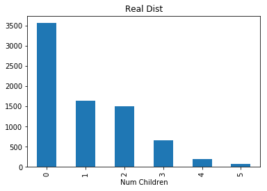
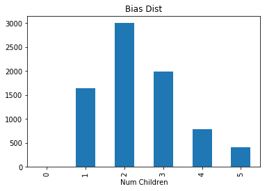

[Think Stats Chapter 3 Exercise 1](http://greenteapress.com/thinkstats2/html/thinkstats2004.html#toc31) (actual vs. biased)

Task: Examine the effects of bias in the observed distribution of family size as a result of surveying children, as opposed to finding the real distribution by actually counting the number of children in each family

Approach: Compute the 'real' and 'biased' distributions of the 'numkdhh' variable in the Responses dataset, plot and compare, and compute and compare their means

First, import required packages:

```python
import pandas as pd
import numpy as np
import matplotlib.pyplot as plt
from collections import Counter
import nsfg
```

Next, get the data:

```python
resp = nsfg.ReadFemResp()
```
Now, use the Counter class to generate a frequency dictionary of the 'real' values:

```python
freqs = Counter(resp['numkdhh'])
```

Use the dictionary to compute the 'real' probability mass function, and then use this pmf to compute the biased one by multiplying the real values by the number of children surveyed (i.e. the keys):

```python
n = resp.shape[0]
pmf_real = {}
for k, _ in freqs.items():
    pmf_real[k] = freqs[k] / n
    
pmf_bias = {}
for k, _ in pmf_real.items():
    pmf_bias[k] = pmf_real[k] * k
```
Convert the pmfs back to frequency distributions. I found it convenient to convert the pmf dictionaries into pandas series here:

```python
ser_real = pd.Series(pmf_real)
ser_bias = pd.Series(pmf_bias)

dist_real = pmf_real * n
dist_bias = pmf_bias * n
```

Finally, plot the distributions and compute their means:

```python
dist_real.index.name = 'Num Children'
dist_bias.index.name = 'Num Children'

dist_real.plot.bar(title='Real Dist')
dist_bias.plot.bar(title='Bias Dist')

real_mean = dist_real.mean()
bias_mean = dist_bias.mean()
print('Real mean = ', real_mean, ';', ' Biased mean = ', bias_mean)
```





Real mean =  1273.8333333333333 ;  Biased mean =  1304.6666666666667
